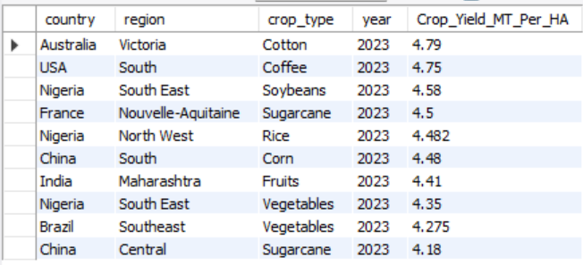
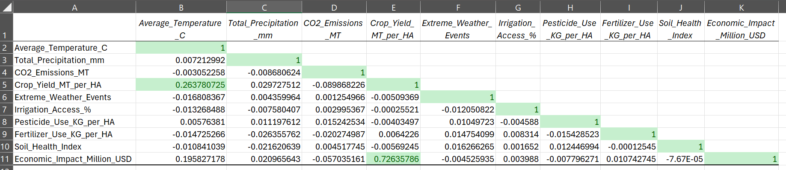
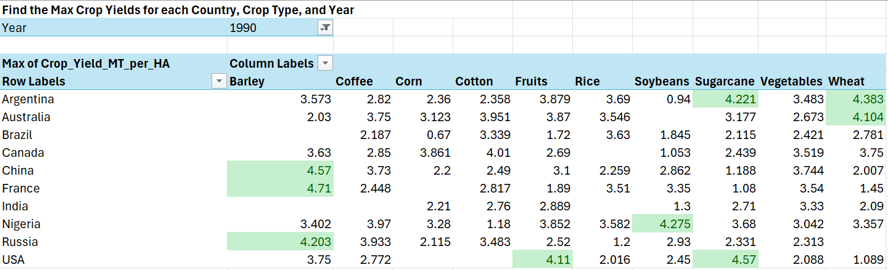
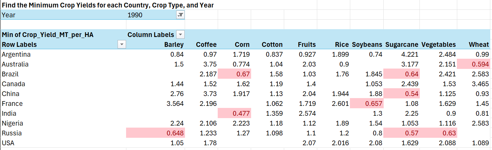
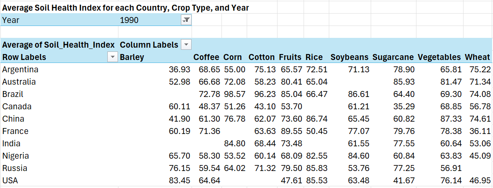
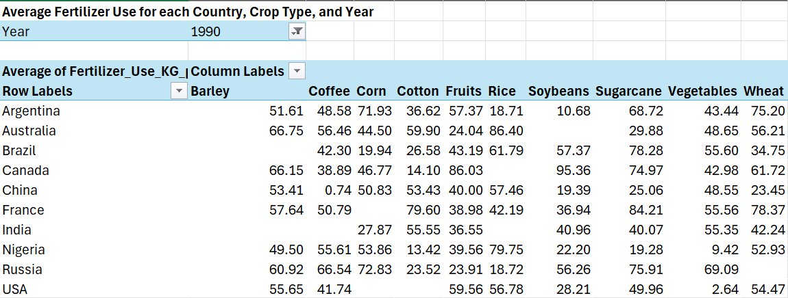
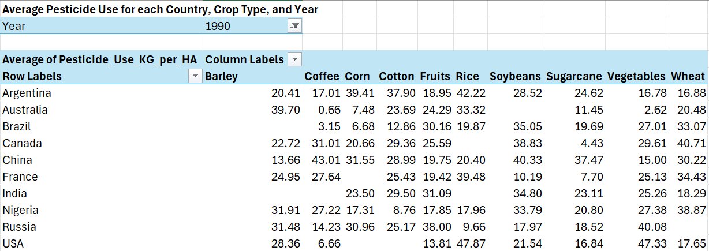
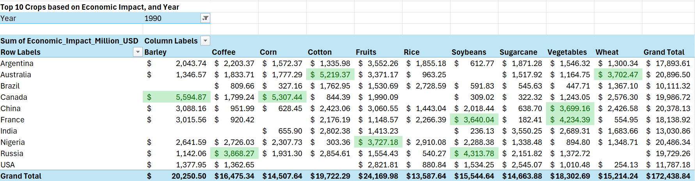

   

# Using Tableau, Excel and SQL to Analyze Climate and Agricultural Data

Climate Change is a growing problem for our planet and has the potential to drastically affect many aspects of our lives. One major concern is how our ability to produce food might change as the climate changes. In this project I took a data set compiling agricultural data with common measures tracking climate change to see what the impact on farming has been so far. To showcase a variety of analytical tools and skills I used a combination of Tableau, Microsoft Excel, and SQL to try to gain insights from this data. I have always been interested in climate science, so this project was a great way to dig into some of the data on this issue, while demonstrating the analysis skills I have been learning as part of the Data Analytics Accelerator course I am taking. 

### Dataset Details

The dataset I used for this project tracks agricultural trends from ten countries spanning thirty-five years (1990 - 2024). The data consists of 10,000 rows and fifteen attribute columns. Each row represents annual data for a specific country, region and crop type. There are qualitative attributes tracking the year, country, region, crop type, and the main climate adaptation strategy used for each record. The quantitative attributes track agricultural and weather measurements such as crop yield in metric tons per hectare, average temperature in celsius, total precipitation in mm, CO2 emissions in metric tons, etc.  I pulled this dataset from Kaggle, and the original file can be found [here.](https://www.kaggle.com/datasets/waqi786/climate-change-impact-on-agriculture/data) My assumption going into this analysis was that there would be strong relationships between trending climate measurements and agricultural outcomes. The main goal for this project was to create some tools and visualizations, and to test my hypothesis by answering these questions:

- What climate attributes have the most significant affects on agriculture?
- How does average temperature affect crop yield?
- Are extreme weather events steadily increasing?
- What are the trends for factors like: CO2 emissions, average temperature, crop yield, precipitation, soil health, pesticide and fertilizer use, and irrigation access?
- What are the crops that have the highest economic impact?
- What are the most used agricultural adaptation strategies for dealing with climate change?

Let's see what I was able to learn from this data. 

## Exploratory Analysis with SQL and Excel

To begin this analysis I first needed to get a sense for the data. I wanted to know how many rows and columns are in the data set, how many years the data covers, and the number and names of countries included in the data. Using the following SQL queries I was able to quickly find those answers.

#### Row and Column Counts
  
  

These two queries gave me the overall shape of the data, showing that there are 10,000 rows and 15 attribute columns for each record. 

#### Year Count and Range
  

The above query counts the number of distinct years shown in the data. Using simple min and max queries I also determined that the lowest and highest years in the data. This data set spans thirty-five years from 1990 to 2024. 

#### Country Count and Names
  
  
  
  
  

To get an accurate count of the countries in this data set I again need to get a distinct count, this time on the country column. Next I wanted a list of the ten countries with records in the data. I also wanted to know if each country had an equal number of records in the data. I determined that this was not the case, and could see that the US and Australia had the most records, with 1,032, and Brazil had the fewest, with 944.  

After getting a good sense for the data I was curious about what I could learn from the data. First, I just wanted to get a quick snapshot of the top 10 highest crop yields from 2023. The following query showed that Australia had the highest crop yield in 2023, growing 4.79 metric tons of cotton per hectare. The US was a close second with 4.75 mt/ha of Coffee. 

#### Top 10 Crops by Yield in 2023
  
  

Next, I wanted to see a list of each country's minimum and maximum crop yields throughout the years included in this data. A simple min / max query was not enough to get the results I wanted, so I turned to a powerful SQL tool, the Common Table Expression (CTE). CTEs allowed me to create temporary virtual tables with part of the results I needed. I could then rejoin these temporary tables with the overall data set to get the list I wanted. Here are the two CTEs I used:

#### Common Table Expressions for Minimum and Maximum Crop Yields
  
  
  
  

By first creating a temporary min and max yields table I could store each country's lowest and highest crop yields. Then I selected the other attributes I wanted from the original "agriculture_impact" table, and joined the stored values to the original dataset. Using the US as an examply I saw that the lowest overall crop yield was recorded in 2019 for the Fruit crop type, and totaled only 0.46 metric tons per hectare. The highest crop yield was Corn in 2008, coming in a 4.9 mt/ha.  

Next, I wanted to see if there were any strong relationships between the recorded attributes that might help me determine some notable trends. A great way to do this is with a correlation matrix. There is not a very intuitive way to do this with SQL queries, so I decided to turn to Microsoft Excel for more analysis. Using the Analysis Toolpak add-in I created the following correlation matrix:

#### Excel Correlation Matrix
  

Based on the correlations calculated in Excel I saw that there are really only two sets of remotely correlated data. Crop yield and average temperature are positively correlated, but with a correlation coefficient of just 0.26, the relationship is not very strong. Ecomonic impact and crop yield have a stronger positive correlation, with a coefficient of 0.73. These results were surprising to me, as I mentioned my assumption was that there would be strong trends showing that climate change was having a significant impact on agriculture. Based on this matrix that is not the case. There are two possible explanations. The first is that climate change does not have a significant impact on agriculture, and my hypothesis is wrong. The second could be that the attributes being measured in this data set are not telling the whole story, or the collection methods are not as accurate as they could be. This is a valuable insight because it signals to those collecting the data, that maybe they need to turn their attention to more significant factors, or improve the measurement procedures to get more accurate results. On the other hand it could just mean that climate change is not a problem for agriculture, but based on the vast majority of other studies being conducted I doubt that is the case. 

## Analysis Tools with Excel

In the next part of this project I wanted to create some useful tools that would allow someone to quickly pull together, summarize, and compare data from this data set. Pivot Tables in Microsoft Excel are a great way to distill large amounts of data into useful summaries for analysis. With the added filtering feature they can be great tools for searching and analyzing specific data. To start off I wanted to create tools that would allow me to see the largest and smallest crop yields for each country, crop type and year. 

#### Maximum and Minimum Yield Pivot Tables
  
  

By bringing country, crop type, and crop yield into the pivot table, and adding a filter for the year I could easily see the highest and lowest yields for each year. I also added some conditional formatting rules to hightlight the top ten yields in the maximum pivot table, and the bottom 10 yields in the minimum table.  

Next, I thought it would be useful to see the average soil health, fertilizer use, and pesticide use for each country, crop type, and year. 

#### Average Soil Health Pivot Table
  

#### Average Fertilizer Use Pivot Table
  

#### Average Pesticide Use Pivot Table
  

These pivot table tools can be used in conjunction with the max and min tools to help identify factors that may have contributed to the hight or low crop yields in a given year. For example, the US grew sugarcane at a high yield of 4.57 mt/ha in 1990. That same year the average soil health index score for sugarcane was 41.67 out of 100, the average amount of fertilizer used was 49.96 kg/ha, and the average amount of pesticides used was 16.84 kg/ha. Knowing these values could help farmers replicate the high-yield results they saw in 1990.  

Finally, I created a pivot table tool to quickly see the top ten crops with the highest economic impact for each country and year. 

#### Top Ten Crops Pivot Table
  

This tool could help countries make resource decisions to maximize the economic benefits of the crops they are growing. 

## Insightful Visualizations with Tableau
