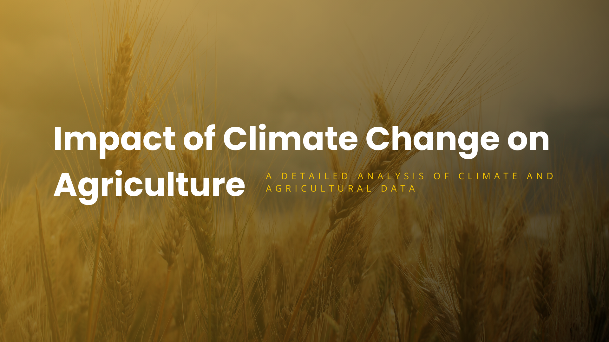
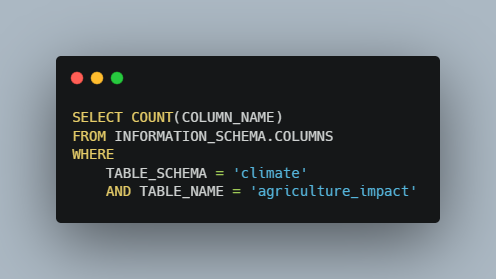
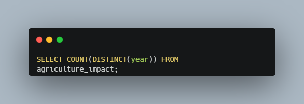
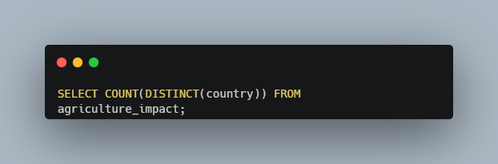
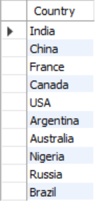
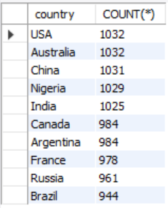
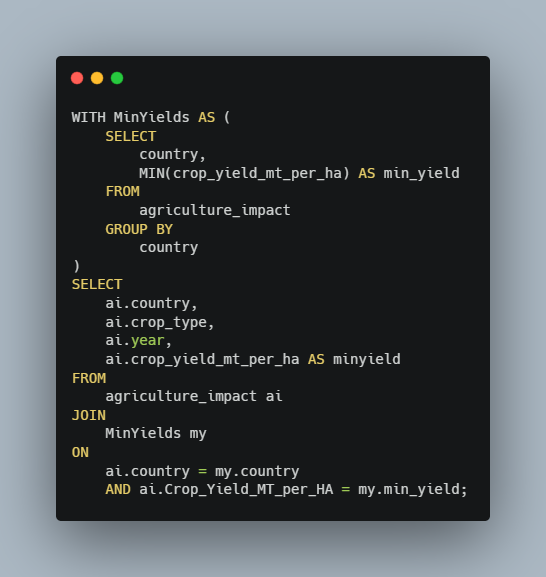
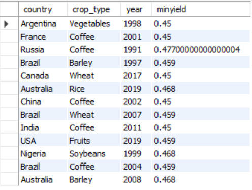

   

# Using Tableau, Excel and SQL to Analyze Climate and Agricultural Data

Climate Change is a growing problem for our planet and has the potential to drastically affect many aspects of our lives. One major concern is how our ability to produce food might change as the climate changes. In this project I took a data set compiling agricultural data with common measures tracking climate change to see what the impact on farming has been so far. To showcase a variety of analytical tools and skills I used a combination of Tableau, Microsoft Excel, and SQL to try to gain insights from this data. I have always been interested in climate science, so this project was a great way to dig into some of the data on this issue, while demonstrating the analysis skills I have been learning as part of the Data Analytics Accelerator course I am taking. 

### Dataset Details

The dataset I used for this project tracks agricultural trends from ten countries spanning thirty-five years (1990 - 2024). The data consists of 10,000 rows and fifteen attribute columns. Each row represents annual data for a specific country, region and crop type. There are qualitative attributes tracking the year, country, region, crop type, and the main climate adaptation strategy used for each record. The quantitative attributes track agricultural and weather measurements such as crop yield in metric tons per hectare, average temperature in celsius, total precipitation in mm, CO2 emissions in metric tons, etc.  I pulled this dataset from Kaggle, and the original file can be found [here.](https://www.kaggle.com/datasets/waqi786/climate-change-impact-on-agriculture/code) My assumption going into this analysis was that there would be strong relationships between trending climate measurements and agricultural outcomes. The main goal for this project was to create some tools and visualizations, and to test my hypothesis by answering these questions:

- What climate attributes have the most significant affects on agriculture?
- How does average temperature affect crop yield?
- Are extreme weather events steadily increasing?
- What are the trends for factors like: CO2 emissions, average temperature, crop yield, precipitation, soil health, pesticide and fertilizer use, and irrigation access?
- What are the crops that have the highest economic impact?
- What are the most used agricultural adaptation strategies for dealing with climate change?

Let's see what I was able to learn from this data. 

## Exploratory Analysis with SQL and Excel

To begin this analysis I first needed to get a sense for the data. I wanted to know how many rows and columns are in the data set, how many years the data covers, and the number and names of countries included in the data. Using the following SQL queries I was able to quickly find those answers.

#### Row and Column Counts
  
  

These two queries gave me the overall shape of the data, showing that there are 10,000 rows and 15 attribute columns for each record. 

#### Year Count and Range
  

The above query counts the number of distinct years shown in the data. Using simple min and max queries I also determined that the lowest and highest years in the data. This data set spans thirty-five years from 1990 to 2024. 

#### Country Count and Names
  
  
  
  
  

To get an accurate count of the countries in this data set I again need to get a distinct count, this time on the country column. Next I wanted a list of the ten countries with records in the data. I also wanted to know if each country had an equal number of records in the data. I determined that this was not the case, and could see that the US and Australia had the most records, with 1,032, and Brazil had the fewest, with 944.  

After getting a good sense for the data I was curious about each country's crop yields. I wanted to see a list of each countries minimum and maximum crop yields throughout the years included in this data. A simple min / max query was not enough to get the results I wanted, so I turned to a powerful SQL tool, the Common Table Expression (CTE). CTEs allowed me to create temporary virtual tables with part of the results I needed. I could then rejoin these temporary tables with the overall data set to get the list I wanted. Here are the two CTEs I used:

#### Common Table Expressions for Minimum and Maximum Crop Yields
  
  
  
  

