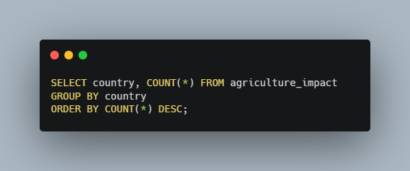
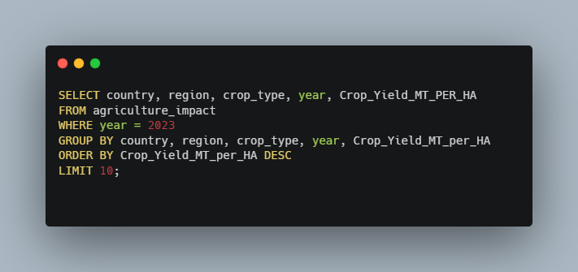
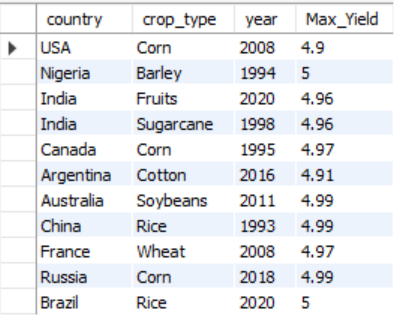
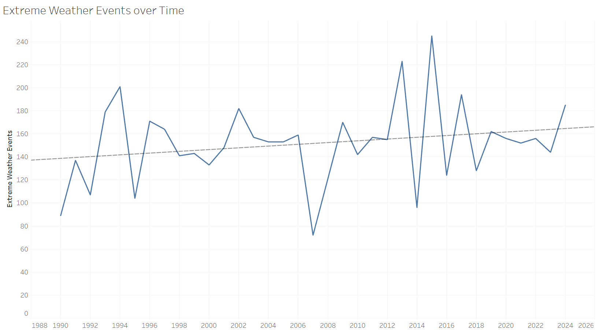

   

# Using Tableau, Excel, and SQL to Analyze Climate and Agricultural Data

Climate Change is a growing problem for our planet and has the potential to drastically affect many aspects of our lives. One major concern is how our ability to produce food might change as the climate changes. In this project I took a data set compiling agricultural data with common measures tracking climate change to see what the impact on farming has been so far. To showcase a variety of analytical tools and skills I used a combination of Tableau, Microsoft Excel, and SQL to try to gain insights from this data. I have always been interested in climate science, so this project was a fantastic way to dig into some of the data on this issue, while demonstrating the analysis skills I have been learning as part of the Data Analytics Accelerator course I am taking. 

### Dataset Details

The dataset I used for this project tracks agricultural trends from ten countries spanning thirty-five years (1990 - 2024). The data consists of 10,000 rows and fifteen attribute columns. Each row represents annual data for a specific country, region, and crop type. There are qualitative attributes tracking the year, country, region, crop type, and the main climate adaptation strategy used for each record. The quantitative attributes track agricultural and weather measurements such as crop yield in metric tons per hectare, average temperature in Celsius, total precipitation in mm, CO2 emissions in metric tons, etc.  I pulled this dataset from Kaggle, and the original file can be found [here.](https://www.kaggle.com/datasets/waqi786/climate-change-impact-on-agriculture/data) My assumption going into this analysis was that there would be strong relationships between trending climate measurements and agricultural outcomes. The main goal for this project was to create tools and visualizations, and to evaluate my hypothesis by answering these questions:

- What climate attributes have the most significant effects on agriculture?
- What are the trends for factors like: CO2 emissions, average temperature, crop yield, precipitation, soil health, pesticide and fertilizer use, and irrigation access?
- How does average temperature affect crop yield?
- What are the crops that have the highest economic impact?
- What are the most used agricultural adaptation strategies for dealing with climate change?
- Are extreme weather events steadily increasing?

This is what I was able to learn from the data. 

## Exploratory Analysis with SQL and Excel

To begin this analysis, I first needed to get a sense for the data. I wanted to know how many rows and columns are in the data set, how many years the data covers, and the number and names of countries included in the data. Using the following SQL queries, I was able to quickly find those answers.

#### Row and Column Counts
  
  

These two queries gave me the overall shape of the data, showing that there are 10,000 rows and fifteen attribute columns for each record. 

#### Year Count and Range
  

The above query counts the number of distinct years shown in the data. Using simple min and max queries I also determined the lowest and highest years in the data. This data set spans thirty-five years from 1990 to 2024. 

#### Country Count and Names
  
  
  
  
  

To get an accurate count of the countries in this data set I again need to get a distinct count, this time on the country column. Next, I wanted a list of the ten countries with records in the data. I also wanted to know if each country had an equal number of records in the data. I determined that this was not the case and could see that the US and Australia had the most records, with 1,032, and Brazil had the fewest, with 944.  

After getting a good sense for the data I was curious about what I could learn from the data. First, I just wanted to get a quick snapshot of the top ten highest crop yields from 2023. The following query showed that Australia had the highest crop yield in 2023, growing 4.79 metric tons of cotton per hectare. The US was a close second with 4.75 mt/ha of Coffee. 

#### Top Ten Crops by Yield in 2023
  
  

Next, I wanted to see a list of each country's minimum and maximum crop yields throughout the years included in this data. A simple min / max query was not enough to get the results I wanted, so I turned to a powerful SQL tool, the Common Table Expression (CTE). CTEs allowed me to create temporary virtual tables with part of the results I needed. I could then rejoin these temporary tables with the overall data set to get the list I wanted. Here are the two CTEs I used:

#### Common Table Expressions for Minimum and Maximum Crop Yields
  
  
  
  

By first creating a temporary min and max yields table I could store each country's lowest and highest crop yields. Then I selected the other attributes I wanted from the original "agriculture_impact" table and joined the stored values to the original dataset. Using the US as an example I saw that the lowest overall crop yield recorded was in 2019 for the Fruit crop type and totaled only 0.46 metric tons per hectare. The highest crop yield was Corn in 2008, coming in at 4.9 mt/ha.  

Next, I wanted to see if there were any strong relationships between the recorded attributes that might help me determine notable trends. A great way to do this is with a correlation matrix. There is not a very intuitive way to do this with SQL queries, so I decided to turn to Microsoft Excel for more analysis. Using the Analysis Toolpak add-in I created the following correlation matrix:

#### Excel Correlation Matrix
  

Based on the correlations calculated in Excel I saw that there are only two sets of remotely correlated data. Crop yield and average temperature are positively correlated, but with a correlation coefficient of just 0.26, the relationship is not very strong. Economic impact and crop yield have a stronger positive correlation, with a coefficient of 0.73. These results were surprising to me, as I mentioned my assumption was that there would be strong trends showing that climate change was having a significant impact on agriculture. Based on this matrix that is not the case. There are two possible explanations. The first is that climate change does not have a significant impact on agriculture, and my hypothesis is wrong. The second could be that the attributes measured in this data set are not telling the whole story, or the collection methods are not as accurate as they could be. This is a valuable insight because it signals to those collecting the data, that maybe they need to turn their attention to more significant factors or improve the measurement procedures to get more accurate results. On the other hand, it could just mean that climate change is not a problem for agriculture but based on the vast majority of other studies conducted I doubt that is the case. 

## Analysis Tools with Excel

In the next part of this project, I wanted to create useful tools that would allow someone to quickly pull together, summarize, and compare data from this data set. Pivot Tables in Microsoft Excel are a terrific way to distill large amounts of data into useful summaries for analysis. With the added filtering feature, they can be great tools for searching and analyzing specific data. To start off I wanted to create tools that would allow me to see the largest and smallest crop yields for each country, crop type and year. 

#### Maximum and Minimum Yield Pivot Tables
  
  

By bringing country, crop type, and crop yield into the pivot table, and adding a filter for the year I could easily see the highest and lowest yields for each year. I also added conditional formatting rules to highlight the top ten yields in the maximum pivot table, and the bottom ten yields in the minimum table.  

Next, I thought it would be useful to see the average soil health, fertilizer use, and pesticide use for each country, crop type, and year. 

#### Average Soil Health Pivot Table
  

#### Average Fertilizer Use Pivot Table
  

#### Average Pesticide Use Pivot Table
  

These pivot table tools can be used in conjunction with the max and min tools to help identify factors that may have contributed to the high or low crop yields in a given year. For example, the US grew sugarcane at a high yield of 4.57 mt/ha in 1990. That same year the average soil health index score for sugarcane was 41.67 out of 100, the average amount of fertilizer used was 49.96 kg/ha, and the average amount of pesticides used was 16.84 kg/ha. Knowing these values could help farmers replicate the high yield results they saw in 1990.  

Finally, I created a pivot table tool to quickly see the top ten crops with the highest economic impact for each country and year. 

#### Top Ten Crops Pivot Table
  

This tool could help countries make resource decisions to maximize the economic benefits of the crops they are growing. 

## Insightful Visualizations with Tableau

One of the most effective ways to gain insights from data is to actually be able to "see" it. Obviously, I could see the data in an excel spreadsheets, but our minds are not the best at making sense of 10,000 lines of text and numbers. Tableau is one of the most effective tools for creating useful data visualizations that can help us wrap our heads around the data that is presented. Below is a screenshot of a Tableau dashboard I created to better understand this dataset. I also encourage you to follow this [link](https://public.tableau.com/app/profile/webb.kimmel/viz/ImpactofClimateChangeonAgriculture/ImpactofClimateChangeonAgriculture) to view my interactive dashboard on Tableau Public. I will walk through the insights I found using these visualizations.

  

These visualizations helped me answer the questions I had when I started this project. The entire dashboard is filtered to show only data for the United States, but this filter can be adjusted to highlight other countries, or all the countries included in the data.  

#### Key Trends Sparklines
On the lefthand side I created the "Key Trends". These area charts show the times series trends for important climate and agricultural measurements. The first four sparklines show yearly trend averages temperature in Celsius, irrigation access %, soil heal index scores, and precipitation in mm. The last for sparklines show annual trends for totals CO2 emissions in metric tons, crop yield in mt/ha, fertilizer use in kg/ha, and pesticide use in kg/ha. These sparklines were surprising to me because they do not show strong positive or negative trends in any of these categories which is counter to my assumption that there would be clear impacts from climate change.  

#### Crop Yield vs Average Temperature
In the top righthand corner of this dashboard I placed a scatterplot comparing crop yield on the y-axis, with average temperature on the x-axis. This comparison produced an interesting distribution. In average temperatures ranging from -5 degrees Celsius to around 10 degrees I saw that there were no crops with a yield higher than 3 mt/ha. Clearly these crops are not fans of cold weather. In the middle of the temperature range (~10 - ~20 degrees Celsius) there seemed to be a sweet spot. This range of temperatures showed the highest ceiling on crop yields, as well as the highest floor. The highest performing crop was corn with 4.9 mt/ha at an average temperature of 10.81 degrees. In the upper range of our temperatures the crop yield suffers again. From around 20 - 35 degrees Celsius the floor on crop yields drops close to the cold-weather levels. However, the ceiling remains high suggesting that many crops can still perform well at higher average temperatures. While our sparkline for average temperature didn't show a strong warming trend, this scatter plot does suggest that higher average temperatures would have a significant impact on crop yields.  

#### Highest Economic Impact Crops
In the middle-left of the dashboard there is a summary table showing the top five crops based on total economic impact in Millions of US Dollars. This offers another snapshot of the most lucrative crops in the US over the thirty-five years of data. Surprisingly, Coffee is the most valuable crop.  

#### Agricultural Adaptation Strategies for Mitigating the Impact of Climate Change
To the right of the top five crops table I created another summary table. This shows the agricultural adaptation strategies ranked from most utilized to least utilized. Water management was the most utilized strategy showing up in 227 records in the US. Organic farming strategies were the least utilized strategy, only appearing in 183 records.  

#### Economic Impact vs Crop Yield
In the bottom-center of the dashboard is another scatter plot. This shows the relationship between economic impact and crop yields. This scatter plot is consistent with the correlation matrix I created in excel, as these were the only two measurements that had a statistically significant relationship. This plot shows that as crop yield increases so does the economic impact. This makes sense: if there are more crops to sell then more money will be made.  

#### Crop Type Tree Map
At the bottom right of the dashboard is a tree map showing all the crop types grown in the US that were part of this data set. The size of the boxes in the tree map is determined by the count of records related to that crop type. Coffee was surprisingly the most represented crop type in the data with 118 records, while soybeans had the fewest records at 85. The tree map also shows the total economic impact of each crop over the past thirty-five years.  

#### Extreme Weather Events
  

While I did not include the above line chart in the dashboard, I was curious if there was any trend in extreme weather events over the thirty-five years of recorded data. This line chart shows the total extreme weather events recorded each year. 2015 had the highest number of extreme weather events with 245, while 2007 had the fewest with seventy-two. Using the trend lines feature in Tableau I saw that there is a slight increasing trend over time, however I determined that this is not a statistically significant trend.  

## Key Takeaways 

I used Excel, SQL, and Tableau to analyze climate and agricultural data. While the results were not what I expected I did find an answer to my initial questions when starting this project.

- The most significant data relationships in this data set were between economic impact vs crop yield, and crop yield vs average temperature. Surprisingly, there were no other statistically significant relationships in any of the data. 
- The data did not show clear positive or negative trends in any of the important climate and agricultural measures, another surprise. 
- The sweet spot for crop yield was between 10-20 degrees Celsius.
- This data was full of surprises and showed that from 1990 to 2024 in the US, coffee was most lucrative crop grown in the US.
- The most utilized agricultural adaptation strategy in the US was water management appearing 227 times.
- There is a slight upward trend in extreme weather events over the course of the thirty-five years recorded, but it was determined to not be a significant trend.

If you are like me then you may have had a few questions about the reliability of this data set. Firstly, my hypothesis was shown to be wrong, and this data appears to show that there is virtually no relationship between climate change and agriculture. This could be true but seems highly unlikely. Secondly, I am fairly certain that the US is not a large producer of coffee, so to see that this was the most grown and highest value crop over the timeframe of this data set was truly shocking. While I do not know the true source or methods for the data collected in this data set, the analytical skills and concepts presented in this project still hold true, and the insights gained were consistent with the data utilized.  

Thank you so much for reading this analysis, I hope you enjoyed it. This was just a fun project I wanted to do to showcase the analytical tools and skills I have been learning as part of my coursework in the Data Analytics Accelerator from Data Career Jumpstart. If you would like to check out my other projects, and follow along for more please connect with me on [LinkedIn.](https://www.linkedin.com/in/james-webb-kimmel-346701a8/) Also please comment any thoughts or feedback you may have had while reading through this analysis, I would love to hear what you think. Thanks again!
