# Analyzing HR Data with R

   

Human Resources are the most valuable resources for any business. It is important to find ways to attract employees that fit are a good fit for the company and role they are performing, and to create an environment that keeps those employees motivated and content at the company. In this data analysis I used R, a powerful statistical analysis language, to gain insights from an IBM HR dataset to try to determine why employee attrition at IBM was increasing.

### The IBM Dataset
For this project I am taking on the role of an IBM People Data Analyst intern. Recently there have been many employees leaving the company and IBM leadership wants to know why. This dataset was created by IBM data scientists but is a fictional dataset. The data contains 1,470 rows each representing an employee, and there ar 35 columns tracking different attributes that describe these employees. The "Attrition" column will be the most important attribute for this project as this tells us whether or not the employee stayed at IBM. There are some columns that contain demographic data such as age, education, and marital status. Other columns contain job-related data like monthly income, years at the company, and some categorical numbers for things like performance rating and work-life balance. I was asked to determine the following:

- Are there any signficant correlations between the most important attributes?
- What trends can be seen between these correlated attributes?
- Is there any evidence of ageism in attrition rates?
- How much do factors like age, monthly income, work-life balance, and distance from home affect the chances of an employee leaving the company?

Let's see what insights we can gain from this data using R.

## Statistical Analysis with R

### Deteriming Data Relationships

First, I wanted to find out if there are any correlations between the most important attributes in this dataset. IBM determined that age, daily rate, distance from home, education, hourly rate, monthly income, monthly rate, number of companies worked at, total working eyars, and training times last year are significant variables they want to track. But, before I determine relationships between these attributes I needed to read the data into RStudio to create a dataframe.

#### Read Data into R
  

Now that I have the dataframe created I can run the correlation matrix for the important attributes using the "cor" function in R. See the results below:

#### Correlation Matrix
 
 

Based on these results I determined that there were significant relationships between Age and Monthly Income, Total Working Years, and Education. To learn more about these relationships I wanted to see the data. A great way to get a quick picture of these relationships is to create a pairplot in R.

#### Pairplot Visualizations
 
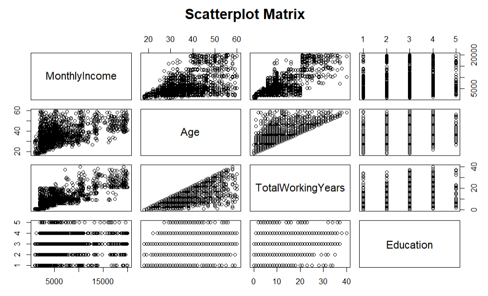 

I can see a few things that stand out in this data visualization. Interestingly, education level does not appear to have a big impact on monthly income, and age is not as big a factor in education as one might expect. Education in this dataset is a categorical numerical value with "1" meaning below college level education, and "5" meaning doctorate level. In these plots I can see multiple employees with doctorate-level education making less than $5,000 per month. I can also see examples of employees in their late 20s and early 30s with doctorates.  

There does appear to be a clear threshold when comparing monthly income with total working years. This plot shows a distinct line where employees with over 20 total working years are making at least $5,000 per month.  

Finally, I see that age does have a positive correlation with monthly income, but again, this is not as pronounced as I expected. While there are no employees under 20 making more than $5,000 per month, employees aged 25 and above have monthly incomes covering the full range of possible values. This is an interesting group of employees!   

### Bias in Firing Decisions?

A disgruntled employee has decided to sue IBM after being laid-off. They claim that the company's layoffs are influenced by ageism, saying that older employees were laid-off at a higher rate than younger ones. Leadership would like to dispel these claims, and needs the data to prove it. To do this I want to do some hypothesis testing. I first wanted to create a boxplot compating Age and Attrition to see the data, and any clear bias that may exist. 

#### Age vs. Attrition Boxplot

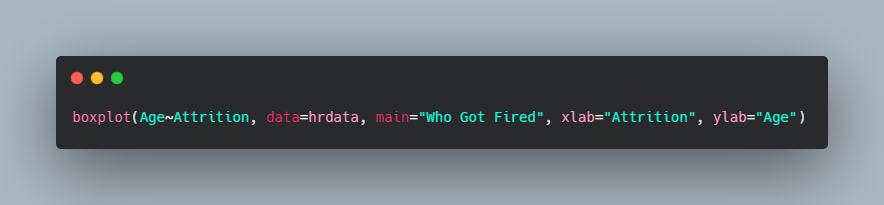 
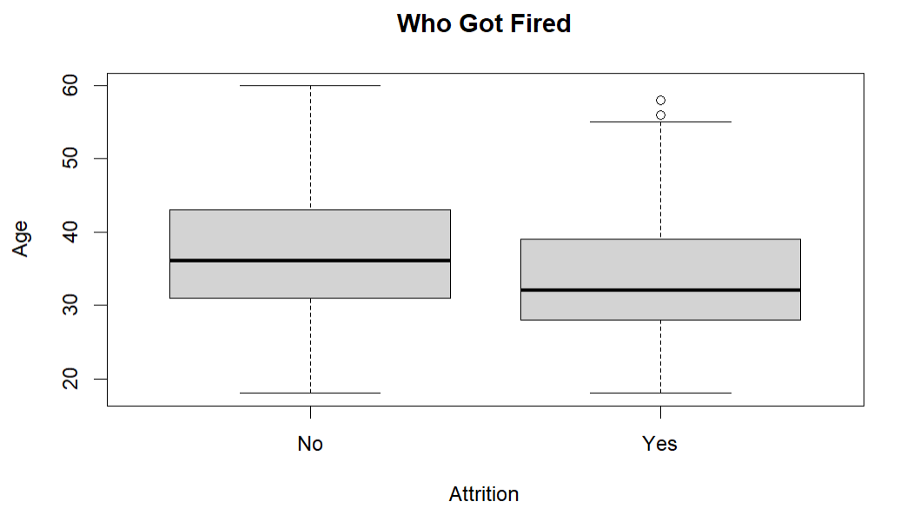 

At first glance these boxplots looks fairly similar. However, the thick black line in these plots shows the median age for the "Yes" and "No" categories from the Attrition column. The median age for the "Yes" column is clearly lower than the median age of the "No" category, meaning the average age of employees that were let go is most likely lower than the average of employees retained. I can further show this by performing a Welch two sample t-test to get a more statistical comparison of the two groups. To perform the t-test I first have to great two new variables, one to represent employees that stayed ("No" values) and one to represent employees that left ("Yes" values). Once I declare these two arrays I can run the t-test.

#### Welch Two Sample T-Test

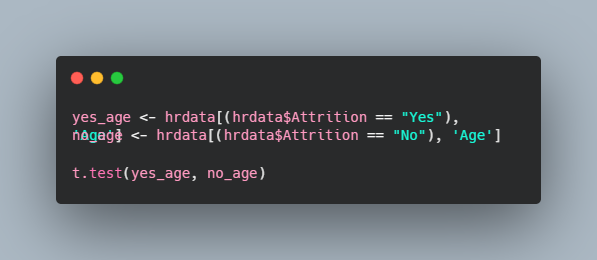 
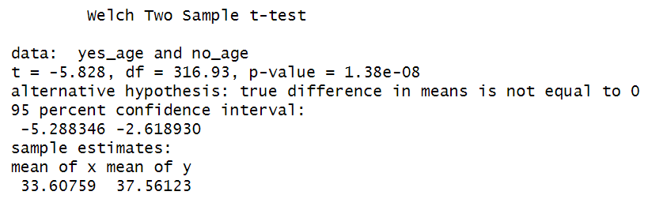 

Looking at these results I can further disprove the claim that ageism was present in layoff decisions. Here the p-value is very important. A p-value of 0.05 or below means that age is a statistically significant factor compared to attrition. Our p-value is much lower, showing that there is a statistcally significant relationship between these two attributes, but not in the way the disgruntled employee claimed. In the results the x variable represents employees that left and the y variable is employees that stayed. Looking at the confidence intervals I can be 95% confident that the "Yes" group is smaller than the "No" group. Futhermore, the mean values for x and y show that the average age of employees that left the company is lower than the average of those who stayed, 34 and 38 respectively. IBM can say, with confidence, that layoffs were not made with an ageism bias.  

### Regression Modeling with R

One of the most powerful uses of R is to create statistical models. A common example of this are linear regressions. With linear regression I can predict a target value by simply knowing some input variables. Here is a simple linear regression I created to predict monthly income based on age. 

#### Monthly Income Regression Model

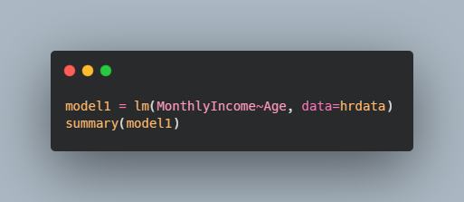 
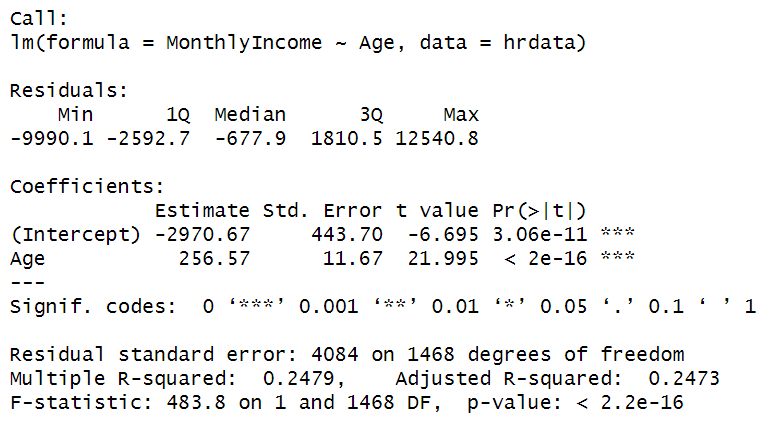 

There is a few key values to examine in the results of this linear regression. The first is the Coefficient Pr(>|t|). This shows the p-values calculated using the probability distribution (t-distribution) created by the regression model. Age has a p-value well below the 0.05 threshold for statistical significance, so I can be confident that age is a significant factor for predicting monthly income. The "Signif. codes" legend is just a quick representation of the significance of our input variable. Because the p-value is basically 0, the age input gets "***", meaning it is very statistically significant. Finally, the R-squared value shows how much of the variance in monthly income can be explained by the input variable (age). In this model the R-squared shows us that about 25% of the variance in monthly income can be explained by changes in age. Pretty cool!  

For this project I am more concerned with predicting attrition for this project. Linear regressions are great for predicting values when comparing continuous data points. The "Attrition" column only has two values though, meaning this data is a binary categorical value. Linear regressions aren't great for predicting binary values. Doing some more research, I determined that I need to use a Logistic Regression, also known as a logit model. However, R cannot interpret string values for the purposes of a logit model, so I first need to convert the "Yes" and "No" values in the attrition column to 1's and 0's.

#### Converting the Attrition Column to Binary Numbers
 

Now that those values have been converted into a readable format for the logit model, I can create some models to see how factors like age, monthly income, work-life balance, and distance from home affect the chances of an employee leaving the company. Here are a few models I created using logistic regression. 

#### Predicting Attrition based on Age

 
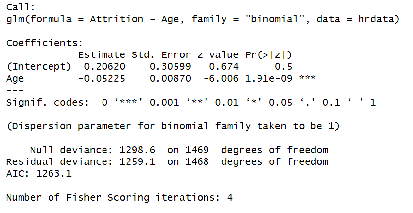 

#### Predicting Attrition based on Monthly Income

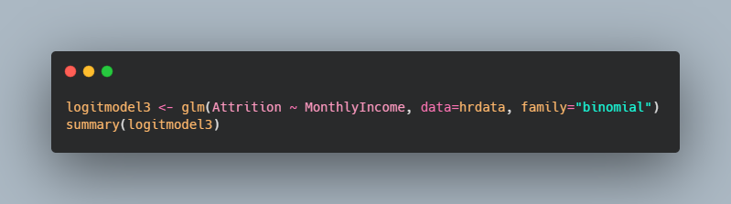 
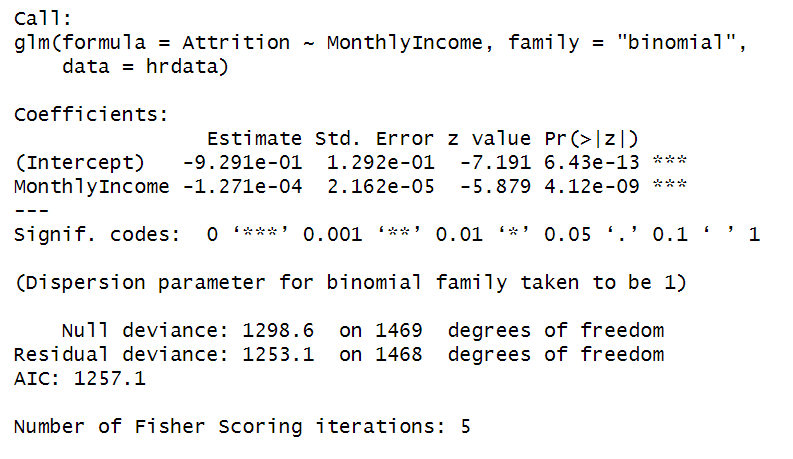 

#### Predicting Attrition based on Work-Life Balance

 
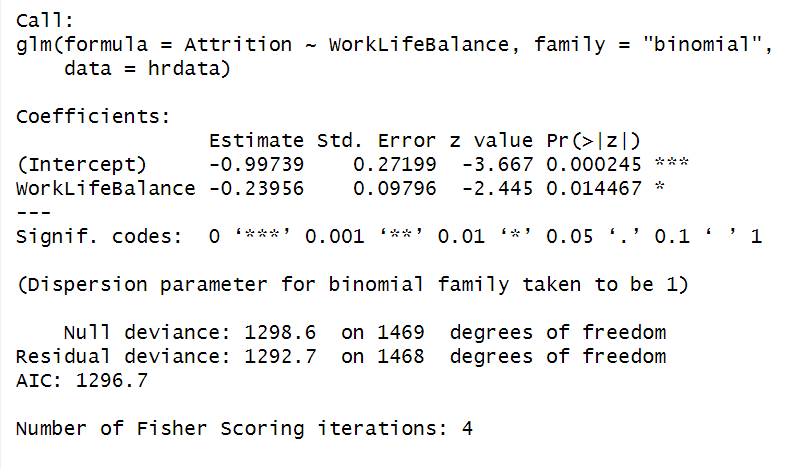 

#### Predicting Attrition based on Distance From Home

 
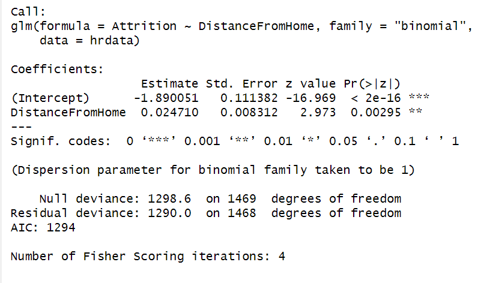 
