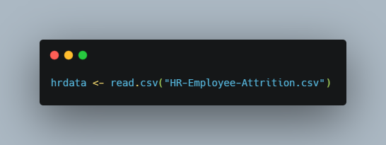
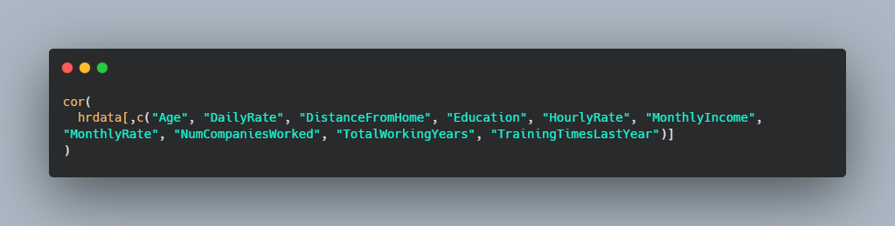
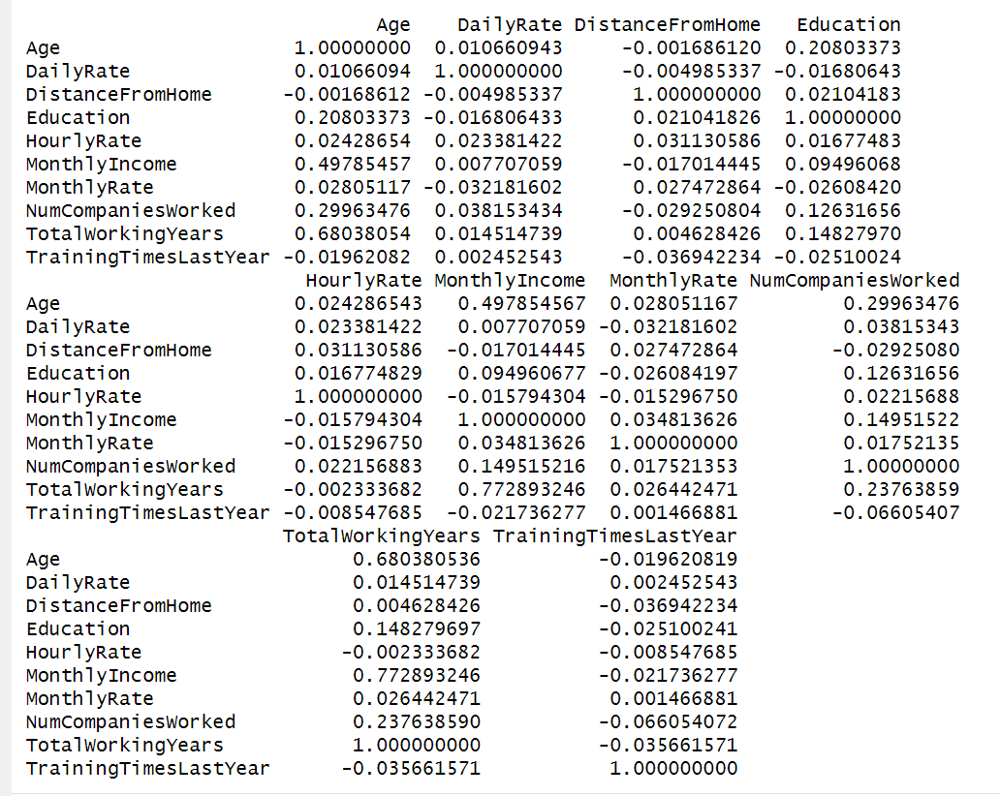

# Analyzing HR Data with R

   

Human Resources are the most valuable resources for any business. It is important to find ways to attract employees that fit are a good fit for the company and role they are performing, and to create an environment that keeps those employees motivated and content at the company. In this data analysis I used R, a powerful statistical analysis language, to gain insights from an IBM HR dataset to try to determine why employee attrition at IBM was increasing.

#### The IBM Dataset
For this project I am taking on the role of an IBM People Data Analyst intern. Recently there have been many employees leaving the company and IBM leadership wants to know why. This dataset was created by IBM data scientists but is a fictional dataset. The data contains 1,470 rows each representing an employee, and there ar 35 columns tracking different attributes that describe these employees. The "Attrition" column will be the most important attribute for this project as this tells us whether or not the employee stayed at IBM. There are some columns that contain demographic data such as age, education, and marital status. Other columns contain job-related data like monthly income, years at the company, and some categorical numbers for things like performance rating and work-life balance. I was asked to determine the following:

- Are there any signficant correlations between the most important attributes?
- What trends can be seen between these correlated attributes?
- Is there any evidence of ageism in attrition rates?
- Were employees just randomly selected for firing?
- How much do factors like age, monthly income, work-life balance, and distance from home affect the chances of an employee leaving the company?

Let's see what insights we can gain from this data using R.

## Statistical Analysis with R

First, I wanted to find out if there are any correlations between the most important attributes in this dataset. IBM determined that age, daily rate, distance from home, education, hourly rate, monthly income, monthly rate, number of companies worked at, total working eyars, and training times last year are significant variables they want to track. But, before I determine relationships between these attributes I needed to read the data into RStudio to create a dataframe.

  

Now that I have the dataframe created I can run the correlation matrix for the important attributes using the "cor" function in R. See the results below:

 
 

