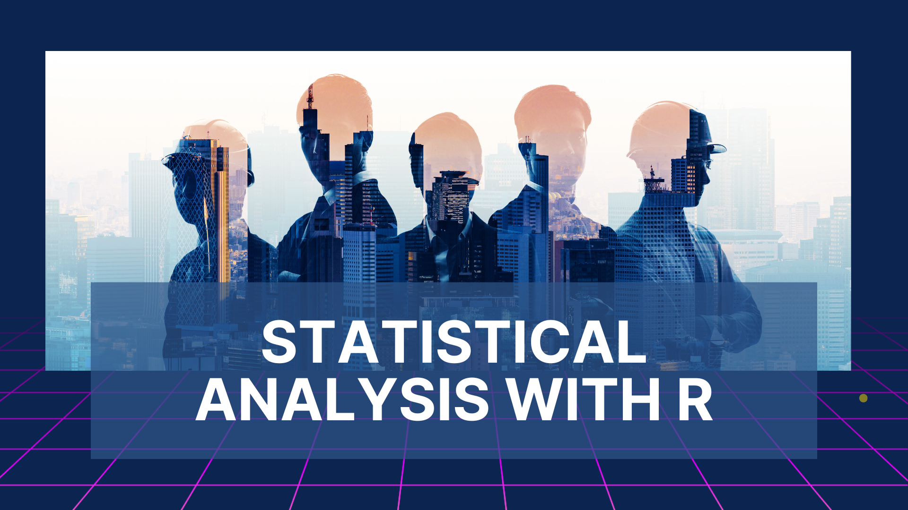

# Analyzing HR Data with R

   

Human Resources are the most valuable resources for any business. It is important to find ways to attract employees that fit are a good fit for the company and role they are performing, and to create an environment that keeps those employees motivated and content at the company. In this data analysis I used R, a powerful statistical analysis language, to gain insights from an IBM HR dataset to try to determine why employee attrition at IBM was increasing.
