# Highlighting Hospital Successes with SQL

   

Hospitals are a critical part of our healthcare infrastructure and one of the main providers of diabetic treatment for millions of people in the US. With rates of diabetes increasing amongst americans it is critical that hospitals are providing sufficient care in an efficient way. Clinical outcomes for diabetic patients have been improving, but only when appropriate care is provided. If hospitals are able to utilize the right treatments sooner, the likelihood of patient readmission decreases. This greatly reduces management and administration costs for the hosptital, while also improving morbidity and mortality rates among diabetic patients.  

To determine how well hospitals are doing I obtained patient data from 130 hospitals tracking clinical care of diabetic patients over the course of ten years (1999 - 2008). Each row of the data represents records of patients diagnosed with diabetes, who stayed in the hospital for up to 14 days while receiving care. For the purpose of this project the data is broken out into two tables, the "health" table and the "demographics" table. The health table shows the lenth of stay at the hospital, lab procedures performed, medications taken, and whether or not the patient was readmitted. There are 101,766 intances in the data with 71,518 distinct patient records. The demographics table shows the patient's race, gender and age. Both tables share the "patient_nbr" attribute as the unique identifier for each record. The original dataset can be found [here](https://www.kaggle.com/code/iabhishekofficial/prediction-on-hospital-readmission/notebook).  

Using SQL I was able to analyze this data and extract some key insights on the hospitals performance. Specifically I was asked to determine the following:  

- Are the majority of patients staying less than 7 days?
- What is the relationship between the number of lab procedures performed and the length of stay at the hospital?
- What are the medical specialties that are utilized the most?
- Is there any racial bias in treatment?
- Were there any patients that had a diabetic emergency, but were discharged from the hospital faster than average?
- What is the the breakdown of readmittance for patients at these hospitals?  

Let's see what we were able to find.

## The Power of SQL: Analysis

SQL is not known for its data visualization capabilities. However, with the right SQL query we can create a basic histogram from the data. This is a great way to quickly find the answer to our first question. Are the majority of patients staying less than 7 days? Here are the results:  

#### Length of Stay SQL Histogram
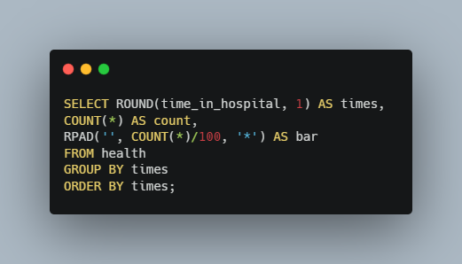 
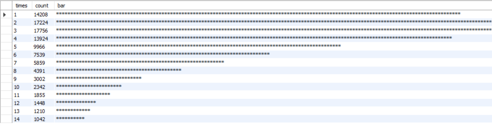 

Using this special SQL script we can see that the vast majorits of patients are in the hospital for less than 7 days, so the hospitals in this dataset are doing great on that front. The RPAD function is the key to this histogram in SQL. RPAD creates a column with a sting value in each row. In this case we are using the COUNT() of patients to determine the lenth of the strings, and representing each patient with an '*' to have the strings represent bars in a histogram. I divided the counts by 100 because we are dealing with a lot of patients. This shortens the bars so that we could see the full histogram on one page. Of the 101,766 instances in this dataset, 80,617 of those resulted in a hospital stay of less than 7 days.  

Next I wanted to determine the relationship between the number of lab procedures performed, and the length of stay at the hospital. Our hospital experts determined that the number of procedures performed could be broken down into three categories. The "Few" category contains patients with less that 25 procedures performed, the "Average" is patients with 25 - 55 procedures, and "Many" procedures is anything above 55. Let's create a summary to see what the average length of stay is for these three categories:  

#### Average Stay vs Number of Procedures Performed
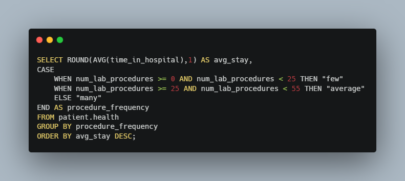 
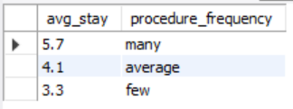 

This breakdown makes a lot of sense. Patients in the "many" category have the longest hospital stays, averaging 5.7 days, while patients in the "few" category have the shortest average stay at 3.3 days. The CASE WHEN function in this query is what allows us to define our category parameters and order our average stay calculations (from the SELECT statement) appropriately. 

Now let's figure out what medical specialties / procedures are utilized the most often. In this case we are looking for specialties that have an average procedure performed count above 2.5, and have a total performance count greater than 50. This ensures that we are looking at procedures that have been performed on many patients, not just a few patients that may have a higher average. Here are the results:  

#### Medical Specialties with the Most Procedures Performed
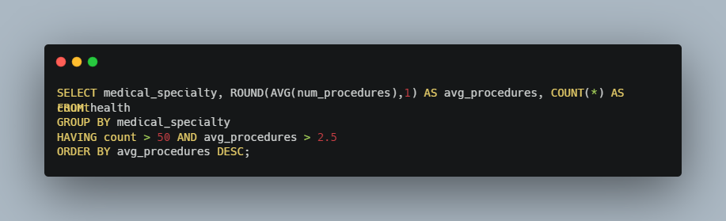 
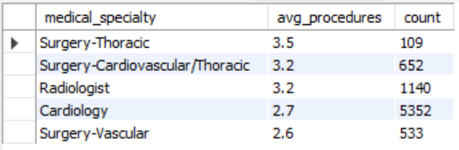 

Using our above parameters we get a list of five medical specialties. The Thoracic Surgery has the highest average, but we can see that the Cardiology specialty has the highest total count of procedures performed with 5,352.  

Ensuring everyone gets equal care is very important, but unfortunately it has been proven that many people and organizations suffer from biases, both conscious and unconscious. Using information from our demographics table alongside the health table data, we should be able to determine if there are any racial biases present in patient treatment. To get a snap shot of this we can break down the data by race and the number of lab procedures performed. In theory a significant difference in the number of procedures performed based on race would indicate a racial bias in patient treatment. What does the data say?

#### Number of Procedures Performed by Race
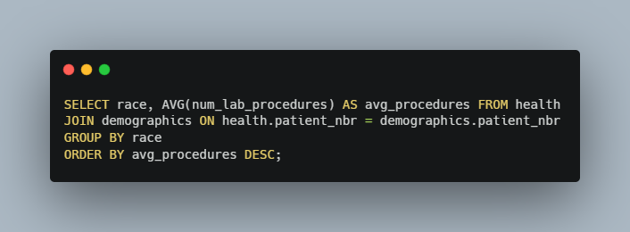 
 

Our aggregated column, the average number of procedures performed, comes from the health table. However, to be able to group these averages by race we need to use a JOIN statement to pull in data from our demographics table. Based on our results there does not seem to be any significant differences in the treatment of different races. This is the result we hope for, and hopefully will come to expect in all cases.  

Let's highlight our hospital successes. For this we will consider a success story as a patient that was admitted with a diabetic emergency, indicated by a "1" in the "admission_type_id" column, and who had a hospital stay that was shorter than the average of 4.4 days. To do this we will need to use a subquery inside our SELECT and WHERE queries because we can't use an aggregating function, like AVG, as a parameter when trying to sort data. The query below is a good example of a subquery, and produces a full list of our success stories:

#### List of Emergency Success Stories
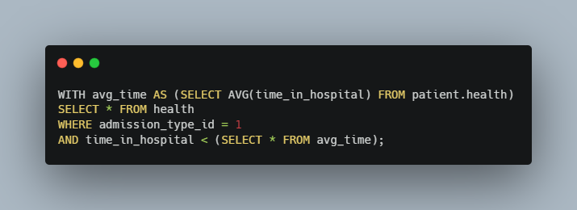 
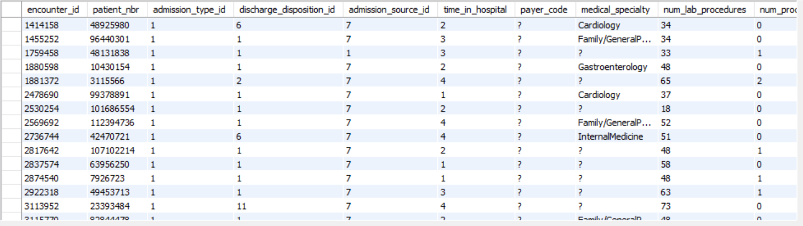 

The WITH statement in the query above allows us to give our subquery results a name that we can then reference in the second query to produce our list of hospital successes. Altering the above query with a COUNT function shows that there 33,684 success stories in out dataset! 

Finally, we want to know how many patients are being readmitted after the treatments listed in this dataset. In an ideal world patients would receive sufficient and appropriate treatments on their first stay, saving money for the hospitals and, more importantly, keeping these patients healthy. To figure out if, and how soon, patients were readmitted we can use another CASE WHEN statement to organize the records based on three categories found in the "readmitted" column. Here are the results:

#### Summary of Patient Readmittance
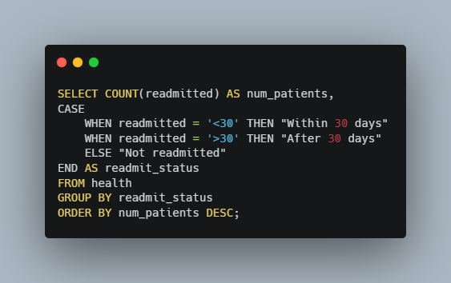 
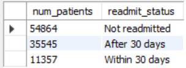 

These results are promising. We can see that most patients (54%) were not readmitted. However, there were many patients that were readmitted after one month, and a significant portion were readmitted within a month of their first hospital stay. This could indicate that the treatments being utilized may not always be what the patients need.   

## Data Insights for Better Healthcare

Using SQL we were able to gain some valuable knowledge from our hospital dataset. To recap we found that:

- 80,617 patients hospitalized for diabetes stayed in the hospital for less than 7 days
- More procedures performed means more time in the hospital, with patients having more than 55 procedures staying in the hospital an average of 5.7 days
- On average Thoracic Surgery is the most utilized medical specialty, while Cardiology and the most total procedures performed at 5,352.
- There was no racial bias in treatment indicated in our dataset
- These hospitals had a lot of success stories with 33,684 emergency cases have a hospital stay shorter than the average of 4.4 days
- 46% of patients were eventually readmitted to the hospital, indicating that initial treatments could be more effectively utilized  

The hospitals in this dataset did a great job with the 101,766 instances of diabetes related hospitalizations. However, the data shows that there is room for improvement. Hopefully, using data insights like these, patient outcomes can be improved in the future.  

