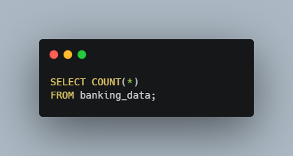
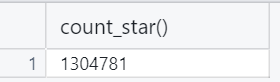
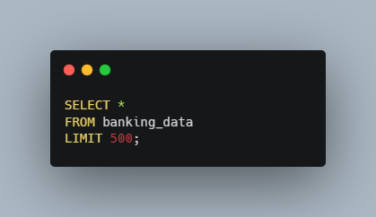
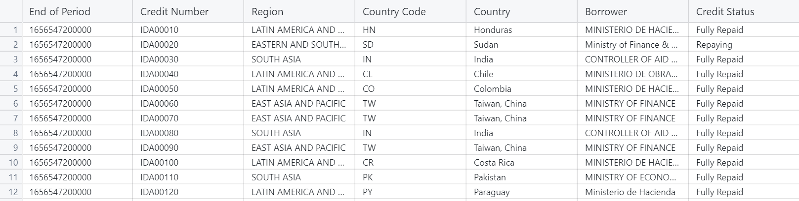
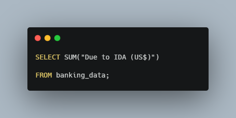
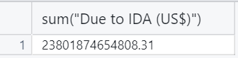
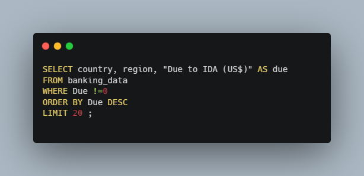
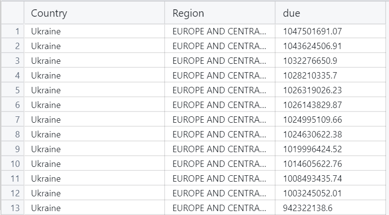
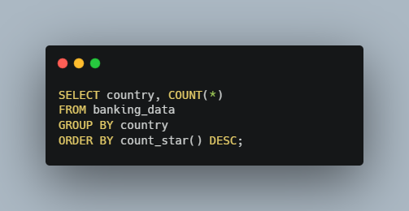
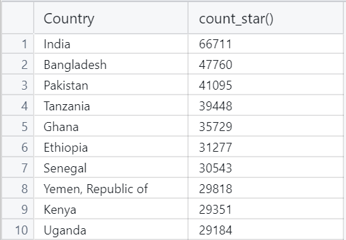

# The World Bank Analysis  
  

Living in the United States we don't often think about international development. But I feel that there is a good case to be made for aiding other countries in their development to help all people enjoy the things we do in the United States. The International Development Association (IDA) does just that. As part of The World Bank the IDA extends credits, grants, and guarentees to its member countries to help them acheive their goals.   
How much money does the IDA grant to its members? Who is the biggest recipient of these funds? What are these funds being used for? I decided to run some SQL queries on the IDA's Statement of Credits and Grants to find out.   

### Here's What I Found  
- The IDA has a total of 1,304,781 transactions
- The total value due to the IDA in USD is $23,801,874,654,808.31, wow!
- The highest amount due to the IDA totals $1,047,501,691.07 and transaction was issued to Ukraine
- India holds the most transactions with 66,711
- There are 6,162 transactions dedicated to the Project Name "Education II"
- The average service charge rate is 0.79% with the highest rate being 7.09% and the lowest being .075%
  

### Dataset Details  
This dataset comes directly from The World Bank and the latest IDA Statement of Credits and Grants can be found [here.](https://finances.worldbank.org/Loans-and-Credits/IDA-Statement-Of-Credits-and-Grants-Historical-Dat/tdwh-3krx/about_data) The data contains 1,304,781 rows representing transactions with 138 distinct countries. The report captures many attributes, but the key attributes include Country, Region, Amount Due to the IDA, Amount Disbursed by the IDA, and Amount Repaid to the IDA, Service Charge Rate, and Credit Status. The data further classifies transactions by Project Name, various transaction dates, and any 3rd parties involved. This is a massive dataset, so let's try to make some sense of it.
  

### My Analysis Using SQL Queries  
To get an overview of this data I needed to see how many rows we're dealing with, and what attributes are being collected. By using a simple Count query I discovered that our report has 1,304,781 rows. I then performed a Select all query to see all the attributes (columns) in the dataset. Because we are working with so much data I had to limit these results to 500 rows. See the queries and results below:  

#### Count All Rows  
  
  
#### Select All Columns  
  
   

Next, I wanted to see what the total amount due to the IDA was. To do this we need to aggregate all the transations with a Select query, and SUM function. We are only concered with the column "Due to IDA (US$)", so we can leave out the rest of the columns. Here's the outcome:  
#### Sum of All Transactions  
  
   
The total is a staggering $23,801,874,654,808.31. To me, it's encouraging to see so much aid going to developmental projects around the world, but where is this money going, and what is it being used for?  

Now it's time for the fun stuff. I wanted to find the highest single amount due to the IDA. For this we could use a simple MAX function with our select query, but for me this leaves out too much detail. I also wanted to know which country and region this transaction was associated with. Typing out "Due to IDA (US$)" over and over is too time comsuming. To get around this I used a SQL alias and changed the column name to "Due" for this query. This is what I got back from the data:  
#### Largest Single Transaction  
  
   
You'll notice that I didn't actually use a Max function in this query. To ensure that I was really seeing the highest result I used the ORDER BY statement and sorted the transactions in descending order. SQL will sort results in ascending order by default so I needed to add DESC to get my desired outcome. These results were surprising. Not only does Ukraine have the highest single transaction, they actually have the highest 13 transactions!   

We saw that Ukraine has the highest value transactions, but I also wanted to know which country had the most total transactions. To do this we need to count the total number of transactions, but now break it down by country. Using the query below we can see that India has the most total transactions at 66,711, significantly higher than the next two countries, Bangladesh and Pakistan:  
#### Total Transactions by Country  
  
   

