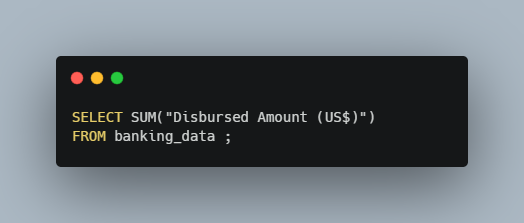
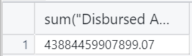
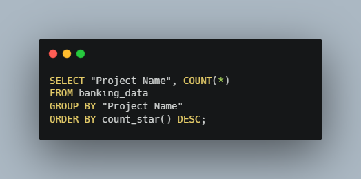
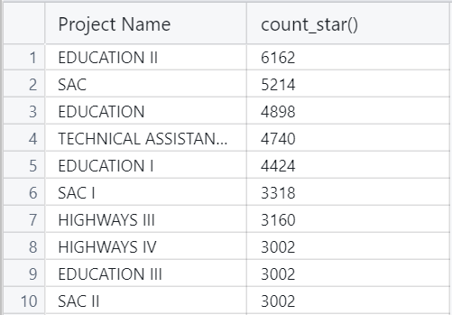

# The World Bank Analysis  
  

Living in the United States we don't often think about international development. But I feel that there is a good case to be made for aiding other countries in their development to help all people enjoy the things we do in the United States. The International Development Association (IDA) does just that. As part of The World Bank the IDA extends credits, grants, and guarentees to its member countries to help them achieve their goals.   
How much money does the IDA grant to its members? Who is the biggest recipient of these funds? What are these funds being used for? I decided to run some SQL queries on the IDA's Statement of Credits and Grants to find out.   

## Here's What I Found  
- The IDA has a total of 1,304,781 transactions
- The total value due to the IDA in USD is $23,801,874,654,808.31, and the total value of money disbursed by the IDA is $43,884,459,907,899.07, wow!
- The highest amount due to the IDA totals $1,047,501,691.07 and transaction was issued to Ukraine
- India holds the most transactions with 66,711
- There are 6,162 transactions dedicated to the Project Name "Education II"
  

## Dataset Details  
This dataset comes directly from The World Bank and the latest IDA Statement of Credits and Grants can be found [here.](https://finances.worldbank.org/Loans-and-Credits/IDA-Statement-Of-Credits-and-Grants-Historical-Dat/tdwh-3krx/about_data) The data contains 1,304,781 rows representing transactions with 138 distinct countries. The report captures many attributes, but the key attributes include Country, Region, Amount Due to the IDA, Amount Disbursed by the IDA, and Amount Repaid to the IDA, Service Charge Rate, and Credit Status. The data further classifies transactions by Project Name, various transaction dates, and any 3rd parties involved. This is a massive dataset, so let's try to make some sense of it.
  

## My Analysis Using SQL Queries  
To get an overview of this data I needed to see how many rows we're dealing with, and what attributes are being collected. By using a simple Count query I discovered that our report has 1,304,781 rows. I then performed a Select all query to see all the attributes (columns) in the dataset. Because we are working with so much data I had to limit these results to 500 rows. See the queries and results below:  

#### Count All Rows  
  
  
#### Select All Columns  
  
   

Next, I wanted to see what the total amount due to the IDA, and the total amount disbursed by the IDA. To do this we need to aggregate all the transations with a Select query, and SUM function. We are only concered with the columns "Due to IDA (US$)", and "Disbursed Amount (US$)" so we can leave out the rest of the columns. Here's the outcomes of those two queries:  
#### Sum of All Transactions Due  
  
  
#### Sum of All Transaction Disbursed  
  
   
The totals are a staggering $23,801,874,654,808.31 due back to the IDA, and a total of $43,884,459,907,899.07 disbursed to member countries. To me, it's encouraging to see so much aid going to developmental projects around the world, but where is this money going, and what is it being used for?  

Now it's time for the fun stuff. I wanted to find the highest single amount due to the IDA. For this we could use a simple MAX function with our select query, but for me this leaves out too much detail. I also wanted to know which country and region this transaction was associated with. Typing out "Due to IDA (US$)" over and over is too time comsuming. To get around this I used a SQL alias and changed the column name to "Due" for this query. This is what I got back from the data:  
#### Largest Single Transaction  
  
   
You'll notice that I didn't actually use a Max function in this query. To ensure that I was really seeing the highest result I used the ORDER BY statement and sorted the transactions in descending order. SQL will sort results in ascending order by default so I needed to add DESC to get my desired outcome. These results were surprising. Not only does Ukraine have the highest single transaction, they actually have the highest 13 transactions!   

We saw that Ukraine has the highest value transactions, but I also wanted to know which country had the most total transactions. To do this we need to count the total number of transactions, but now break it down by country. Using the query below we can see that India has the most total transactions at 66,711, significantly higher than the next two countries, Bangladesh and Pakistan:  
#### Total Transactions by Country  
  
   

Finally I wanted to see what kind of projects these IDA funds are going to. We'll want to get a count of the transactions again, but this time we will group them by the "Project Name" attribute. We will put them in descending order again to see which projects have the most transactions. Check out the results:  
#### Projects with the Most Transactions  
  
   
The project name with the most transactions is "Education II". You'll also notice that three out of the top five projects are related to education. Seems like a worthwhile investment to me!   

## Investing in the Future  
#### SQL is a powerful tool that allows us to turn a huge dataset over 1 million rows long into manageable and meaningful pieces. We were able to gain some interesting insights into a huge organization driving development around the world. Using a few queries we learned that:   
- The IDA has issued 1,304,781 transactions, providing funds for 138 different countries in the form of credits and grants
- $43,884,459,907,899.07 USD has been disbursed among these member countries, and $23,801,874,654,808.31 is currently due to be repaid to the IDA
- Ukraine and India receive a lot of funding from the IDA, with Ukraine having the highest value transactions and India holding the most total transactions
- Education projects are the primary destination for IDA funds with 3 out of the top 5 spots when organizing total transactions by project name   

Thank you for reading this analysis of The World Bank's International Development Association's Statement of Credits and Grants. This was a great project to immerse myself in SQL queries and international financial data. If you would like to follow along on my continuing data journey please connect with me on [LinkedIn](https://www.linkedin.com/in/webb-kimmel-346701a8/) and feel free to reach out with any comments or questions you have about this analysis!
